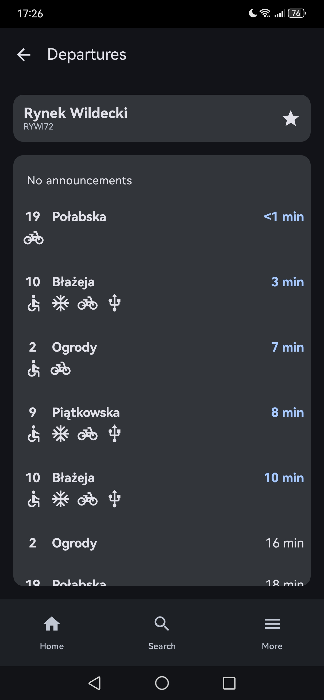
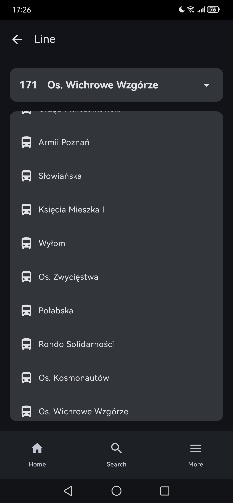
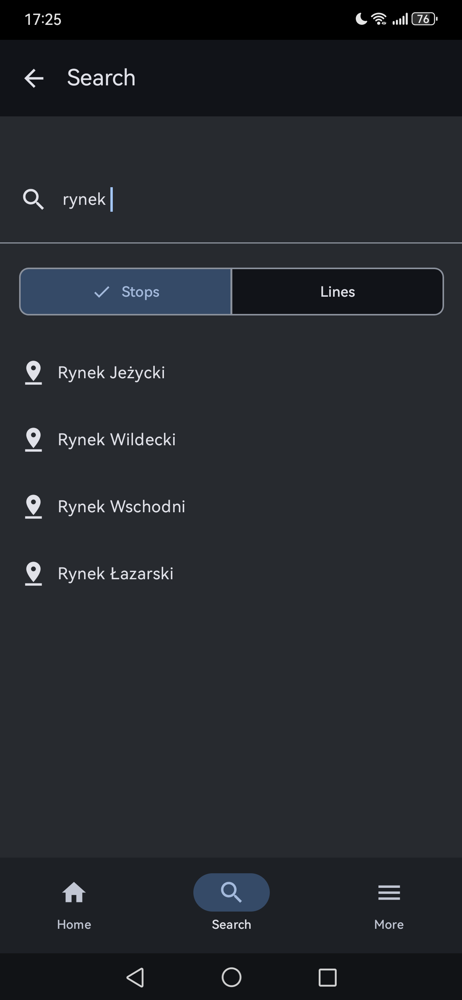
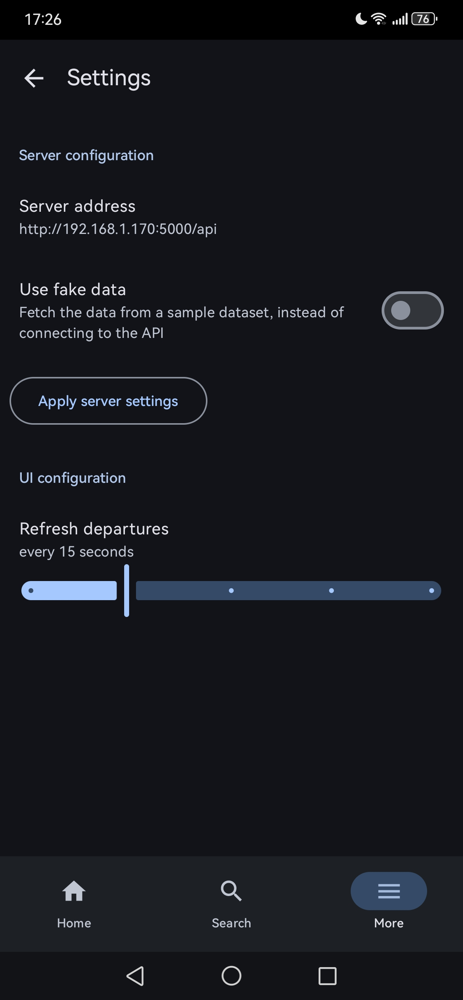
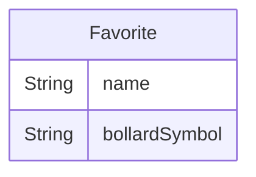

# PozDroid
Native Android frontend for my [PozNode](https://github.com/creeper82/poznode) project. Built with Jetpack Compose and Kotlin. Connects to the backend, with an option to use a fake dataset

# Features
- Display departures
- Display line stops
- Search for stops and lines
- Pin favorites to home screen
- Connect to a self-hosted backend server
- **Material Design 3** UI with **Material You** dynamic colors
- and more..?!

# Screenshots

  
  
  
  

# Technical details
The app uses `Room` to manage the SQLite database. The database is only used to store favorite stops, and the schema looks as follows:

